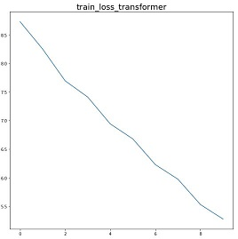

# A Pytorch Implementation of [Transformer](https://arxiv.org/abs/1706.03762)

## Requirements
* python==3.6.8
* torch==1.0.1

## Training
* STEP 1. Run the command below to download [IWSLT 2016 German–English parallel corpus](https://wit3.fbk.eu/download.php?release=2016-01&type=texts&slang=de&tlang=en).
```
bash download.sh
```
 It should be extracted to `iwslt2016/de-en` folder automatically.
* STEP 2. Run the command below to create preprocessed train/eval/test data.
```
python prepro.py
```
If you want to change the vocabulary size (default:32000), do this.
```
python prepro.py --vocab_size 8000
```
It should create two folders `iwslt2016/prepro` and `iwslt2016/segmented`.

* STEP 3. Run the following command.
```
python train.py
```

Check `hparams.py` to see which parameters are possible. For example,
```
python train.py --logdir myLog --batch_size 256 --dropout_rate 0.5
```

* STEP 3. Or download the pretrained models.
```
wget -qO- --show-progress https://dl.dropbox.com/s/efv2gmq5hu3np43/log.tar.gz | tar xz
```


## Training Loss Curve with Transformer

## Bleu score on devset with Transformer


## Training Loss Curve with Transformer

## Bleu score on devset with Transformer

