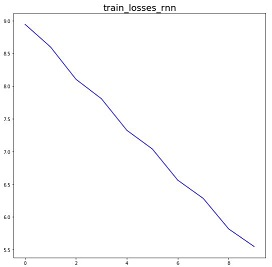

# A Pytorch Implementation of [Transformer](https://arxiv.org/abs/1706.03762)

## Requirements
* python==3.6.8
* torch==1.0.1

## Training
* python Transformer_WMT.py ( python RNN_WMT.py )
```

## Training Loss Curve with Transformer

## Bleu score on devset with Transformer


## Training Loss Curve with RNN

## Bleu score on devset with RNN

